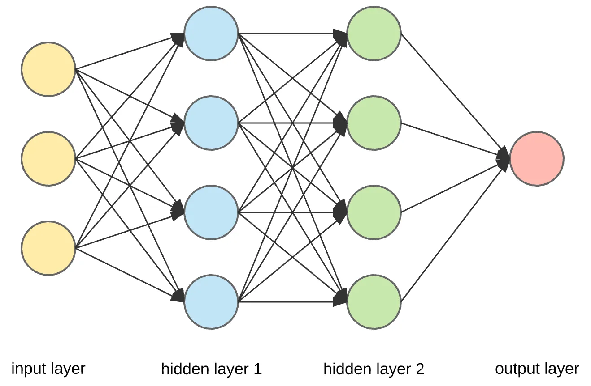
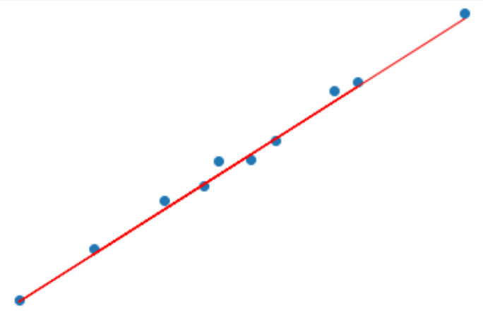
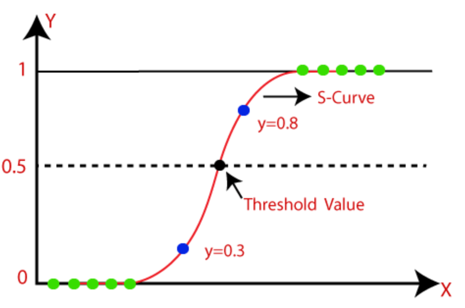
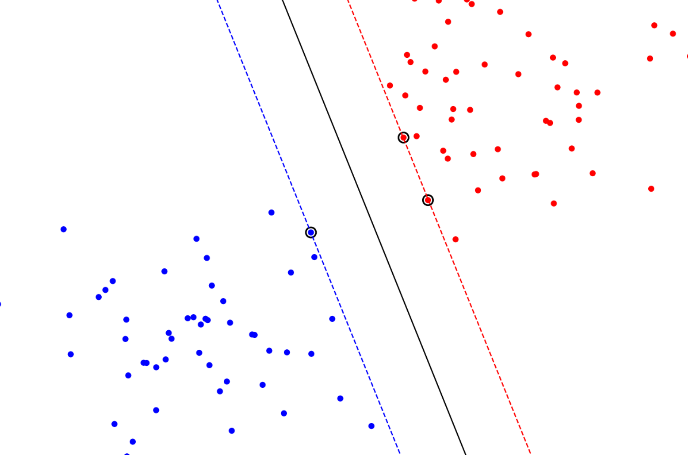
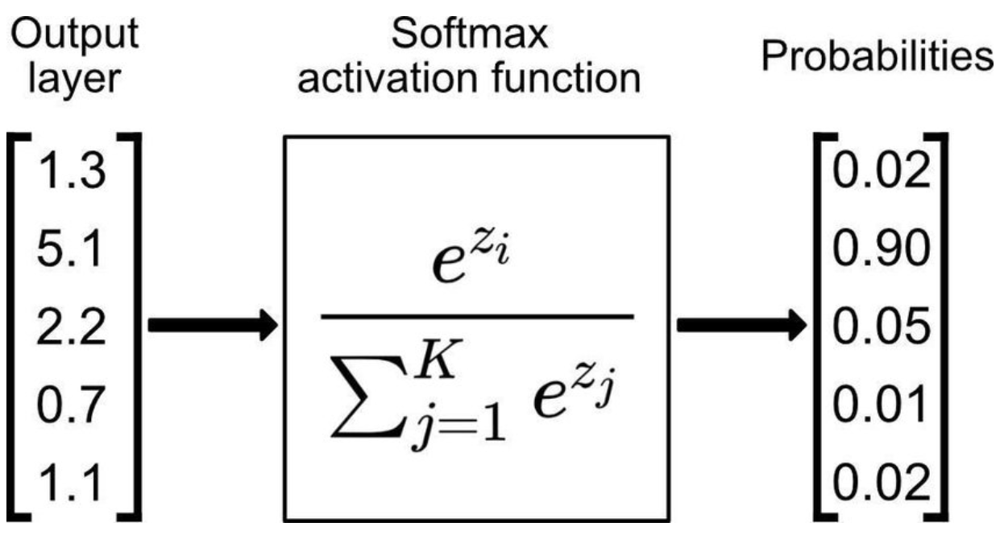

# Intro to Machine Learning

A repository for the programming assignments in the "Intro to Machine Learning" course.

The assignments included the following subjects:

[Perceptron](perceptron/README.md "Perceptron") | [Linear Regression](linear_regression/README.md) | [Logistic Regression](logistic_regression/README.md)
:---: | :---: | :---:
 |  | 

[Support Vector Machine](svm/README.md) | [Multiclass Logistic Regression](multiclass_logistic_regression/README.md) | [Neural Network](neural_network/README.md)
:---: | :---: | :---:
||