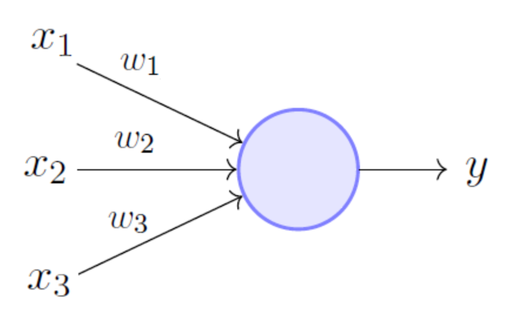
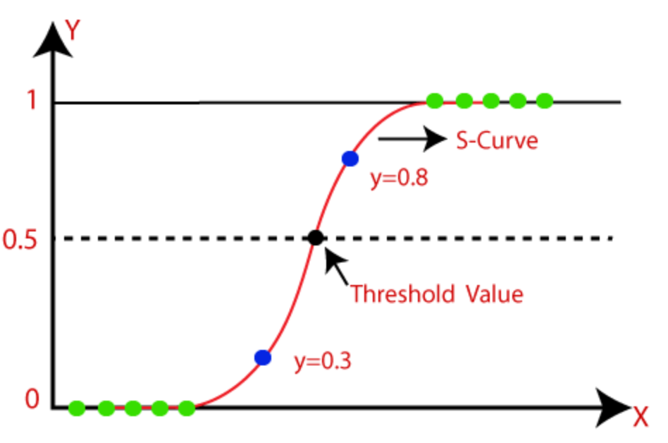
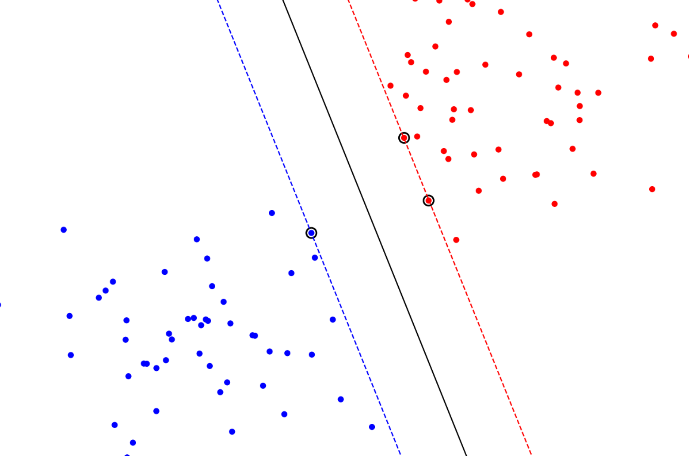
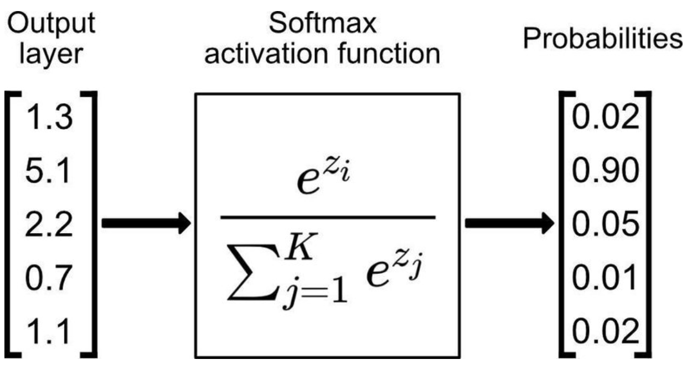
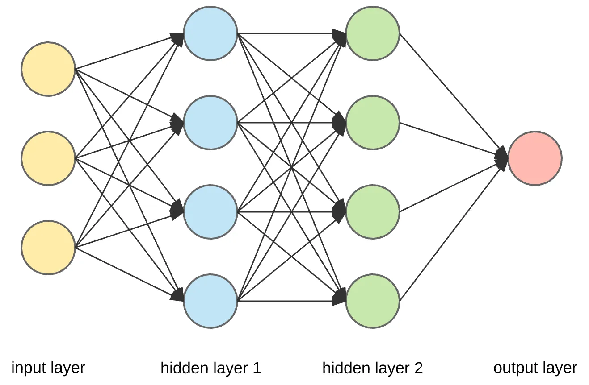

# Intro to Machine Learning

A repository for the programming assignments in the "Intro to Machine Learning" course.

The assignments included the following subjects:

[Perceptron](perceptron) | [Linear Regression](linear_regression) | [Logistic Regression](logistic_regression)
:---: | :---: | :---:
 |  | 

[Support Vector Machine](svm) | [Multiclass Logistic Regression](multiclass_logistic_regression) | [Neural Network](neural_network)
:---: | :---: | :---:
||
